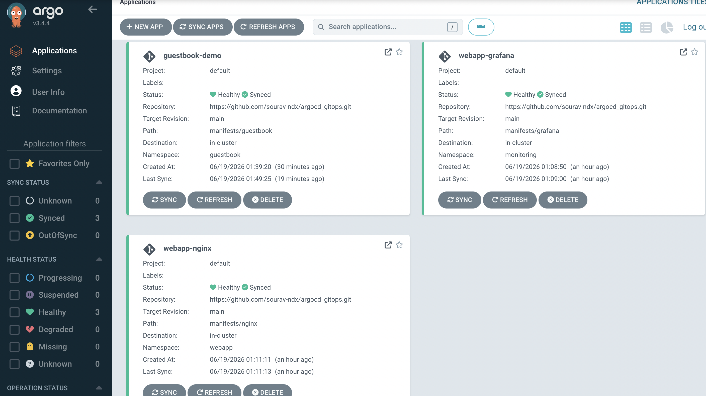
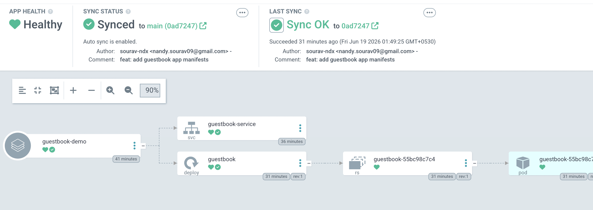
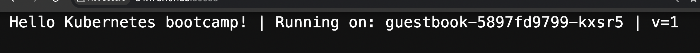
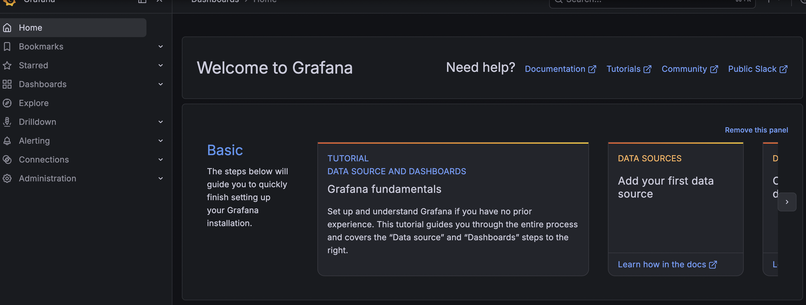
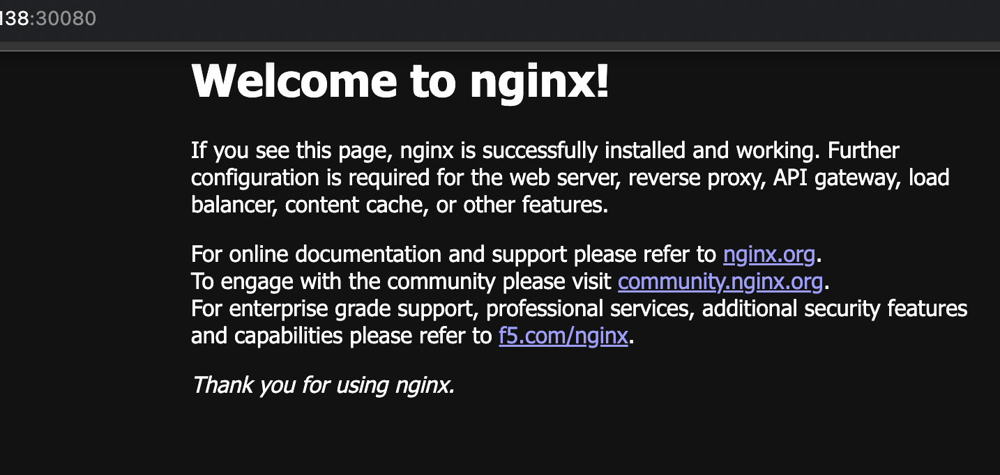

<div align="center">

# 🚀 ArgoCD GitOps on kubeadm Cluster
### Deploying nginx, Grafana and Guestbook via GitOps — on a self-built Kubernetes cluster on GCP


<br/>

> This repo is about understanding GitOps properly — not just following a tutorial on a managed cluster.
> Built on raw GCP VMs using kubeadm, which means everything that could go wrong, did.
> The learnings from that are honestly more valuable than the setup itself.

</div>

---

> **📌 Note:** This repo demonstrates GitOps and ArgoCD concepts — deploying real workloads, testing self-healing, managing apps through Git. It is not a production-grade application. The point is understanding the pattern, not the apps themselves.

Built on top of [k8s-kubeadm-gcp](https://github.com/sourav-ndx/k8s-kubeadm-gcp) — the cluster behind all of this.

---

## 💡 What I Learned

The concept clicked fast — Git as the source of truth, cluster always matching what is in the repo, delete something manually and it comes back automatically. That self-healing moment when I deleted a deployment and watched ArgoCD recreate it within seconds — that is when it actually made sense, not when I read about it.

What took longer was everything around it. Full story in [docs/troubleshooting-learnings.md](docs/troubleshooting-learnings.md).

---

## 📸 Screenshots

### ArgoCD Dashboard — All Apps Synced and Healthy


### Guestbook App Resource Graph in ArgoCD UI


### Apps Running in Browser




---

## 📁 Repository Structure

```
argocd_gitops/
├── argo-apps/
│   ├── nginx-application.yaml          # ArgoCD Application — watches manifests/nginx
│   ├── grafana-application.yaml        # ArgoCD Application — watches manifests/grafana
│   ├── guestbook-application.yaml      # ArgoCD Application — watches manifests/guestbook
│   └── argocd-server-nodeport.yaml     # Custom NodePort Service for ArgoCD UI
├── manifests/
│   ├── nginx/
│   │   ├── deployment.yaml
│   │   └── service.yaml                # NodePort 30080
│   ├── grafana/
│   │   ├── deployment.yaml
│   │   └── service.yaml                # NodePort 30030
│   └── guestbook/
│       ├── deployment.yaml
│       └── service.yaml                # NodePort 30088
├── docs/
│   ├── gitops-explained.md             # Concepts deep dive — read this first
│   ├── troubleshooting-learnings.md    # What broke and what fixed it
│   └── gcp-setup-guide.md             # GCP-specific prerequisites and firewall rules
└── README.md
```

---

## 🌐 Why NodePort Instead of LoadBalancer

This cluster runs on raw kubeadm VMs — there is no cloud controller to provision external load balancers. If you set `type: LoadBalancer` on any Service, the EXTERNAL-IP stays `<pending>` forever because nothing in the cluster knows how to fulfil it.

NodePort is the right choice here — it opens a fixed port on every node and you access the app directly via `<node-ip>:<nodeport>`. Simple, no external dependencies, works on any bare metal or self-managed cluster.

Full comparison in [docs/gitops-explained.md](docs/gitops-explained.md).

---

## ⚠️ GCP Prerequisites — Do This First

> Running on raw GCP VMs? You need specific firewall rules before anything works. Full guide here: [docs/gcp-setup-guide.md](docs/gcp-setup-guide.md)

---

## 🔧 Setup — Install ArgoCD

```bash
kubectl create namespace argocd
kubectl apply -n argocd -f https://raw.githubusercontent.com/argoproj/argo-cd/stable/manifests/install.yaml
kubectl get pods -n argocd -w
```

### Expose ArgoCD UI via NodePort

```bash
# Delete the default ClusterIP Service that comes with install.yaml
kubectl delete svc argocd-server -n argocd

# Apply our own NodePort Service
kubectl apply -f argo-apps/argocd-server-nodeport.yaml
kubectl get svc argocd-server -n argocd
```

### Get admin password

```bash
kubectl get secret argocd-initial-admin-secret -n argocd -o jsonpath="{.data.password}" | base64 -d
```

Username: `admin`

### Get current external IP

> GCP ephemeral IPs change every time you stop a VM — always check after restart

```bash
gcloud compute instances describe k8s-control \
    --zone=us-central1-a \
    --format="get(networkInterfaces[0].accessConfigs[0].natIP)"
```

Access UI: `https://<external-ip>:30843`

---

## 🚀 Deploy the Applications

```bash
git clone https://github.com/sourav-ndx/argocd_gitops.git
cd argocd_gitops

kubectl apply -f argo-apps/nginx-application.yaml
kubectl apply -f argo-apps/grafana-application.yaml
kubectl apply -f argo-apps/guestbook-application.yaml

kubectl get applications -n argocd -w
```

> ArgoCD reads those Application objects, pulls the manifests from this GitHub repo, and deploys everything automatically. You never touch the manifests folder directly — that is the whole point.

---

## 🌍 Access the Apps

| App | URL | Login |
|:---|:---|:---|
| **ArgoCD UI** | `https://node-ip:30843` | admin / (from secret above) |
| **nginx** | `http://node-ip:30080` | — |
| **Grafana** | `http://node-ip:30030` | admin / admin123 |
| **Guestbook** | `http://node-ip:30088` | — |

---

## 🧪 Test Self-Healing

```bash
# Delete nginx deployment manually
kubectl delete deployment nginx -n webapp

# Within seconds — check again
kubectl get deployment nginx -n webapp
# It is back. ArgoCD detected the drift and recreated it from Git.
```

> This is the single most important thing to demonstrate when explaining GitOps — it proves the cluster is no longer the source of truth. Git is.

---

## 🔄 Force a Manual Sync

```bash
kubectl patch application webapp-nginx -n argocd --type merge -p '{"operation":{"sync":{}}}'
```

---

## 🧹 Cleanup

```bash
kubectl delete -f argo-apps/
kubectl delete namespace webapp monitoring guestbook argocd
```

---

## 📖 Further Reading

- [GitOps and ArgoCD Explained](docs/gitops-explained.md) — concepts, syncPolicy deep dive, field-by-field Application YAML breakdown
- [Troubleshooting and Learnings](docs/troubleshooting-learnings.md) — what broke, what fixed it, full debugging approach
- [GCP Setup Guide](docs/gcp-setup-guide.md) — all GCP-specific prerequisites and firewall rules with exact CLI commands

---

## 👤 Author

**Sourav Nandy** — Platform and DevOps Engineer | CKA Certified
Ericsson / Verizon | OpenShift Production SME | 8+ Years

[](https://linkedin.com/in/sourav-nandy-0115)
[](https://github.com/sourav-ndx)

---

<div align="center">

*Built on [k8s-kubeadm-gcp](https://github.com/sourav-ndx/k8s-kubeadm-gcp) — the cluster behind this GitOps setup.*

⭐ Star this repo if it helped you understand GitOps and ArgoCD

</div>
